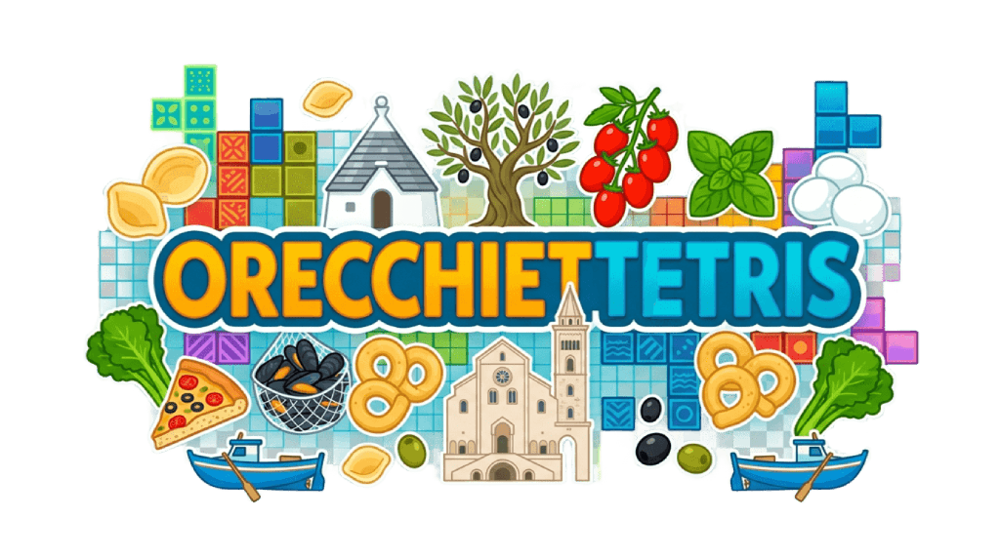

# 

An exact copy of the Tetris game, with Apulian elements. Built as a Software Engineering university project.

## Requirements

- Python >= 3.11
- [Poetry](https://python-poetry.org/) (dependency manager)
- [Kivy](https://kivy.org/) >= 2.3 (installed automatically by Poetry)
- Node >= 25 and npm >= 11.11 (for semantic-release)

### In-Game keyboard controls

| Key | Action |
| --- | --- |
| ← / → | Move left / right |
| ↓ | Soft drop |
| ↑ or X | Rotate clockwise |
| Space | Hard drop |
| C | Hold |
| P or Escape | Pause / Resume |
| Q | Quit |
| M | Toggle music |
| N | Next track |
| B | Previous track |

## Installation

### From PyPI

```bash
pip install OrecchietTetris
OrecchietTetris
```

### From source

1. Clone the repository:

    ```bash
    git clone https://github.com/unibo-dtm-se-2425-OrecchietTetris/OrecchietTetris-artifact
    cd OrecchietTetris-artifact
    ```

2. Install Poetry if you don't have it yet:

    ```bash
    pip install -r requirements.txt
    ```

3. Install the project's dependencies (creates `.venv/` inside the project):

    ```bash
    poetry install
    npm install
    ```

4. (Optional) Install pre-commit hooks for commit-message linting:

    ```bash
    .venv/bin/poe hooks        # macOS / Linux
    .venv\Scripts\poe hooks    # Windows
    ```

## Virtual environment

All project commands run inside the `.venv/` virtual environment created by Poetry.
Activate it once per terminal session, then use tools directly without any prefix:

```bash
python3 -m venv .venv

# macOS / Linux
source .venv/bin/activate

# Windows (PowerShell)
.venv\Scripts\Activate.ps1

# Windows (cmd)
.venv\Scripts\activate.bat
```

To deactivate:

```bash
deactivate
```

## Usage

Activate the virtual environment (see above), then run the game:

```bash
OrecchietTetris
```

or:

```bash
python -m OrecchietTetris
```

## Development

Activate the virtual environment first, then use the following commands directly.

### Run tests

```bash
poe test
```

Run a single test file or test case:

```bash
pytest -v tests/model/test_tetromino.py
pytest -v tests/model/test_tetromino.py::test_rotations
```

### Coverage

```bash
poe coverage
```

### Lint & type check

```bash
poe flake8
poe mypy
```

## Architecture

The project uses the **Observer pattern** to decouple game logic from the view, with **abstract interfaces** for dependency inversion.

### Components

| Component | Role |
| --- | --- |
| `Tetromino(ITetromino)` | Falling piece with clockwise rotation |
| `Board(IBoard)` | Pure grid engine — collision, locking, line clearing |
| `Tetris(ITetris)` | Game orchestrator; fires `EventType` events on every state change |
| `MenuScreen(IView)` | Kivy main menu with language selector |
| `GameScreen(IView)` | Kivy 10×20 board, previews, score, keyboard input |
| `TetrisApp(App)` | Kivy application; manages screen transitions |
| `I18n` | Runtime EN/IT string lookup |
| `BlockRenderer` | Maps piece integers to RGBA colours and image paths |

### Observer events (`EventType` enum)

| Event | When | Data |
| --- | --- | --- |
| `BOARD_UPDATED` | piece moved, rotated, or locked | `None` |
| `NEW_PIECE` | new piece spawned | `ITetromino` |
| `HOLD_UPDATED` | hold slot changed | `ITetromino \| None` |
| `LINES_CLEARED` | lines removed | `int` |
| `SCORE_UPDATED` | score changed | `int` |
| `GAME_OVER` | spawn blocked | `None` |
| `PAUSED` / `RESUMED` | pause toggled | `None` |

## Tetromino Blocks

Each tetromino uses a unique block icon drawn from Apulian food imagery.

| Block | Shape | Apulian Food |
| --- | --- | --- |
|  | I | Mozzarella |
|  | O | Orecchietta |
|  | T | Uva (Grape) |
|  | S | Cime di rapa (Turnip Tops) |
|  | Z | Frisella |
|  | J | Cozze Tarantine (Tarantino Mussels) |
|  | L | Focaccia |

## Soundtrack

You are not ready for this. A list of the best Apulian - and not only - artists!

| Track | Artist | Song |
| --- | --- | --- |
| [01](assets/music/mp3/01.mp3) | Caparezza | Abiura di Me |
| [02](assets/music/mp3/02.mp3) | Serena Brancale | Baccalà |
| [03](assets/music/mp3/03.mp3) | Kid Yugi | Massafghanistan |
| [04](assets/music/mp3/04.mp3) | Sud Sound System | Le Radici Ca Tieni |
| [05](assets/music/mp3/05.mp3) | Boombadash ft. Alessandra Amoroso | Mambo Salentino |
| [06](assets/music/mp3/06.mp3) | Sal Da Vinci | Rossetto e Caffè |
| [07](assets/music/mp3/07.mp3) | Al Bano ft. Romina Power | Felicità |
| [08](assets/music/mp3/08.mp3) | Caparezza | Jodellavitanonhocapitouncazzo |
| [09](assets/music/mp3/09.mp3) | Checco Zalone | Angela |
| [10](assets/music/mp3/10.mp3) | Elvira Visone ft. Luca Sarracino | Mi Hai Rotto il Cuore |
| [11](assets/music/mp3/11.mp3) | Domenico Bini | Sta Andando Tutto Male |
| [12](assets/music/mp3/12.mp3) | Leone Di Lernia | La festa d' patron |
| [13](assets/music/mp3/13.mp3) | GemBoy | La Guerra Di Piero |

You can find the .mp3 files of the soundtrack in ```assets/music/mp3```. Enjoy!
